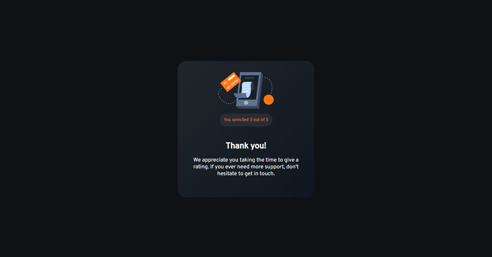

# Frontend Mentor - 3-column preview card component solution

This is a solution to the [interactive rating component challenge on Frontend Mentor](https://www.frontendmentor.io/challenges/interactive-rating-component-koxpeBUmI/hub/interactive-rating-component-2YhpXnoRLT). Frontend Mentor challenges help you improve your coding skills by building realistic projects. 

## Table of contents

- [Overview](#overview)
  - [Screenshot](#screenshot)
  - [Links](#links)
  - [Continued development](#continued-development)
- [Author](#author)

## Overview

This is a simple project that helped me to improve my coding skills by building realistic projects, and it is a real proof that I'm really learning to program.

### Screenshot

DESKTOP

MOBILE

### Links

- Solution URL: [GITHUB REPOSITORY](https://github.com/MikeyRG127/interactive-rating-component-main)
- Live Site URL: [LIVE SITE](https://interactive-rating-component-main-k7yn.vercel.app/)

### Built with

- Semantic HTML5 markup
- CSS custom properties
- CSS Grid
- JavaScript DOMs

### Continued development

N/A

## Author
-
- Website - [MikeyRG](https://www.mikeyrg127.com)
- GITHUB - [@MikeyRG127](https://github.com/MikeyRG127/)
